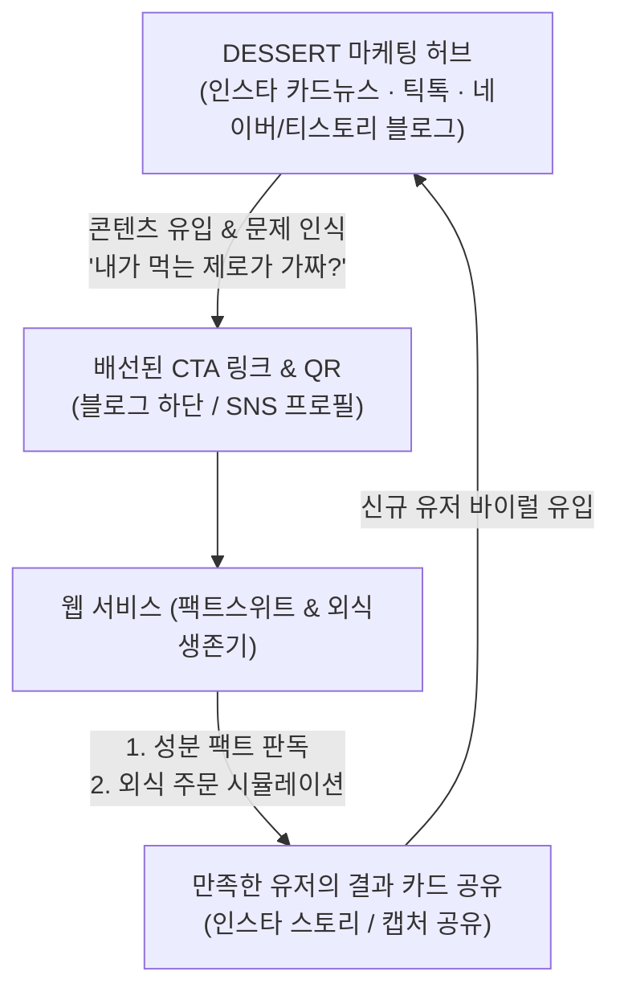

# DESSERT 인사이트 기반 서비스 기획 및 제품 스펙

> **기반 프로젝트:** `@dessrtj` 디저트 팩트체크 콘텐츠 허브 (`/Users/name/Desktop/Cluade/DESSERT`)  
> **목적:** 콘텐츠 제작 과정에서 축적된 소비자의 핵심 페인포인트와 과학적 영양 팩트를 기반으로, 실제 사용자가 이용할 수 있는 디지털 서비스(B2C Web/App) 모델 및 제품 스펙 정리

---

## 1. 배경 및 핵심 소비자 인사이트 (Insights)

DESSERT 프로젝트의 팩트체크 기획서와 데이터베이스에서 도출된 현대 다이어터들의 5대 핵심 문제입니다:

1. **'가짜 제로'와 말티톨의 배신**
   - 시판 "무설탕/제로슈거" 가공식품(쿠키, 초콜릿, 젤리, 빵 등) 중 상당수가 설탕 혈당의 60~70%를 자극하는 **말티톨(Maltitol, GI 35~52)**을 주원료로 사용.
   - 소비자는 "제로슈거니까 혈당도 안 오르고 살도 안 찌겠지"라고 믿고 섭취하지만 인슐린 스파이크와 체중 증가를 겪음.

2. **인공감미료/당알코올 섭취 한도 무지와 장 트러블 (IBS)**
   - 알룰로스 성인 1일 안전 섭취 권장량(24g), 에리스리톨 내약량 한도 등을 모른 채 하루 종일 제로음료, 단백질바, 무설탕 간식을 섭취하다 원인 모를 복부 팽만, 가스, 설사를 겪음.

3. **토핑과 숨은 당류의 함정**
   - 요거트 아이스크림(요아정 등)이나 그릭요거트 자체는 건강하지만, 벌집꿀, 초코쉘, 그래놀라 등 토핑을 추가하면서 한 컵에 당류가 30~50g으로 폭증.

4. **외식 칼로리 폭탄의 진짜 주범 (삼겹살 한 상 2,280 kcal)**
   - 삼겹살집 외식 시 고기(단백질/지방) 자체보다 냉면(550 kcal), 소주 1병(408 kcal), 쌈장/볶음밥 등 곁들이 탄수화물/알코올로 인해 성인 하루 권장 칼로리 전체를 한 끼에 섭취.

5. **성분표 해독의 높은 진입장벽**
   - 일반 소비자는 제품 뒷면의 복잡한 원재료명(수크랄로스, 아스파탐, 알룰로스, WPI/WPC, 에리스리톨 등)을 봐도 무엇이 안전하고 무엇이 함정인지 판독 불가.

---

## 2. 도출된 4대 서비스 모델

### 서비스 모델 ①: 【팩트스위트 (FactSweet)】
#### *제로·다이어트 식품 성분 팩트체크 판독기 (핵심 MVP 추천)*

- **타겟 유저**: 편의점/마트/올리브영에서 다이어트 간식, 제로 음료, 프로틴바를 자주 구매하는 2040 다이어터
- **해결 가치**: 성분표 사진 촬영 또는 제품명 검색만으로 "진짜 제로인지, 가짜 제로인지" 3초 만에 판정
- **주요 기능**:
  1. **가짜 제로 (말티톨) 감지기**:
     - 원재료에 말티톨/소르비톨 등 혈당 유발 감미료 포함 시 ⚠️ 경고 및 혈당 자극 지수(GI) 표시.
  2. **다이어터 안전 신호등 등급**:
     - 🟢 **안심 (A)**: 알룰로스, 스테비아, 에리스리톨 기반, 당류 2g 미만
     - 🟡 **주의 (B)**: 당류 5g 이상 또는 토핑/부재료로 인한 칼로리 증가
     - 🔴 **주의필요 (C)**: 말티톨 주성분, 무설탕이지만 고칼로리/고탄수화물
  3. **클린 대체 식품 추천**:
     - 예: "이 초콜릿 대신 말티톨이 없고 알룰로스로 만든 [000 초콜릿]을 추천해요."
  4. **팩트 카드 공유**:
     - 인스타그램 스토리, 단톡방 공유용 팩트체크 요약 카드 이미지 자동 생성.

---

### 서비스 모델 ②: 【외식생존기 (EatSurvival)】
#### *다이어터 외식 시뮬레이터 & 스마트 주문 가이드*

- **타겟 유저**: 회식, 약속, 데이트로 외식을 피할 수 없지만 체중 감량을 유지하고 싶은 직장인/다이어터
- **해결 가치**: 메뉴별 살찌는 주범(곁들이, 소스, 주류)을 사전에 파악하고, 최적의 생존 주문 조합을 시뮬레이션
- **주요 기능**:
  1. **외식 카테고리별 한 상 시뮬레이터**:
     - 카테고리: 삼겹살/소고기, 치킨, 마라탕, 떡볶이, 샤브샤브, 파스타, 프랜차이즈 카페
     - 기본 주문 시 예상 칼로리/당류/탄수화물 폭탄 수치 시각화 (예: 삼겹살 2인분+소주+냉면 = 2,280 kcal)
  2. **생존 최적화 토글 (Interactive Calorie Cutter)**:
     - 곁들이/주류/소스 옵션을 변경할 때마다 실시간으로 칼로리가 감량되는 인터랙티브 UI:
       - [물냉면 ❌ → 된장찌개+밥 1/3공기 ⭕ (-450 kcal)]
       - [소주 1병 ❌ → 제로탄산 음료/연한 하이볼 ⭕ (-350 kcal)]
       - [쌈장 듬뿍 ❌ → 소금/생와사비/기름장 ⭕ (-150 kcal)]
  3. **30초 외식 생존 카드 (모바일 뷰)**:
     - 식당 입장 직전 폰으로 보는 행동 강령:
       1) 채소/파절이 먼저 먹기 (혈당 스파이크 방어)
       2) 고기는 단백질이니 즐겁게 먹기
       3) 탄수화물 마무리 컷

---

### 서비스 모델 ③: 【배탈제로 (GutSafe)】
#### *인공감미료·당알코올 일일 섭취 한도 트래커*

- **타겟 유저**: 제로 음료와 헬스 보충제/프로틴 간식을 달고 살며 만성 가스/설사/복통을 겪는 유저
- **해결 가치**: 하루 동안 섭취한 다양한 가공식품 속 감미료 총량을 합산하여 장 건강 안전선 모니터링
- **주요 기능**:
  1. 오늘 먹은 제로 식품/음료 간편 기록 (제로콜라, 단백질 쉐이크, 제로 젤리 등)
  2. 성분별 일일 섭취량 누적 시각화:
     - 알룰로스: 성인 1일 권장 24g 대비 현재 N% (게이지 차트)
     - 에리스리톨/수크랄로스/아스파탐 등 성분별 허용치 비교
  3. 장 안전 경보 시스템:
     - "오늘 알룰로스 26g 섭취로 가스 및 소화불량 주의 구간입니다. 수분을 충분히 섭취하세요."

---

### 서비스 모델 ④: 【디저트 팩트 백과 (Dessert Fact Wiki)】
#### *과학적 식품 영양 & 대체당 지식 허브*

- **타겟 유저**: 성분에 꼼꼼한 헬시플레저 소비자, 당뇨/혈당 관리 환자 및 가족
- **주요 기능**:
  - 감미료별(알룰로스, 에리스리톨, 스테비아, 말티톨, 수크랄로스, 아스파탐, 아세설팜칼륨 등) 혈당 지수(GI), 인슐린 반응, 흡수율, 일일 허용 섭취량(ADI) 비교 데이터베이스.
  - 최신 식약처/WHO 연구 팩트체크 브리핑.

---

## 3. 콘텐츠 마케팅(DESSERT)과 서비스 간의 시너지 구조 (Growth Flywheel)

1. **콘텐츠(DESSERT)가 트래픽 유입 엔진**:
   - 인스타그램 카드뉴스 및 네이버/티스토리 블로그 포스팅 하단에 "내 간식 성분 3초 판독기 바로가기" 링크 연결.
2. **서비스가 리텐션 및 데이터 허브**:
   - 유저들이 자주 검색하는 성분/외식 메뉴 데이터를 수집하여 다시 다음 DESSERT 콘텐츠 주제로 선순환.

---

## 4. 추천 기술 스택 & MVP 개발 로드맵

- **프론트엔드**: Next.js 14/15 (React, TypeScript, Tailwind CSS)
- **배포**: Vercel 또는 Cloudflare Pages
- **데이터 저장소**: Supabase (PostgreSQL) 또는 로컬 경량 JSON DB
- **1단계 MVP**: `팩트스위트 (성분 판독 & 대체 추천)` + `외식생존기 (외식 시뮬레이터)` 통합 인터페이스로 구현.
