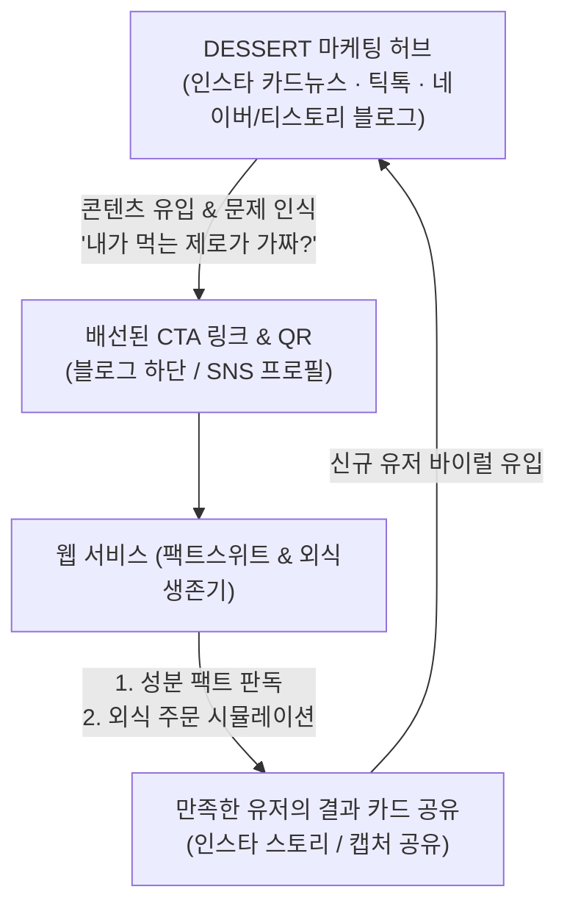

# 🍨 DESSERT 인사이트 기반 4대 프로덕트 상세 명세서

> **기반 프로젝트:** `@dessrtj` 디저트 팩트체크 콘텐츠 허브 (`/Users/name/Desktop/Cluade/DESSERT`)  
> **문서 보관 경로:** `/Users/name/cursor/app/docs/PRODUCT_SPECIFICATIONS.md`  
> **목적:** DESSERT 콘텐츠 허브에서 검증된 영양 팩트, 감미료 데이터, 외식 칼로리 실태를 기반으로 실제 개발 가능한 4대 B2C 디지털 서비스 모델 및 제품 사양 정의

---

## 📌 1. 배경 및 문제 정의 (Problem Statement)

DESSERT(@dessrtj) 프로젝트의 수십 편의 팩트체크 기획서와 식약처/WHO 공인 데이터에서 도출된 핵심 소비자 문제는 다음과 같습니다:

1. **'가짜 제로'와 말티톨의 배신**
   - 시판 "무설탕/제로슈거" 가공식품(초콜릿, 쿠키, 젤리 등) 상당수가 설탕 혈당의 60~70%를 자극하는 **말티톨(Maltitol, GI 35~52)**을 주원료로 사용.
   - 소비자는 무설탕 마케팅만 믿고 섭취하다 인슐린 스파이크와 체중 증가를 겪음.

2. **인공감미료/당알코올 복용 한도 무지와 장 트러블 (IBS)**
   - 알룰로스 성인 1일 안전 섭취 권장량(24g), 에리스리톨 내약량 한도 등을 모른 채 하루 종일 제로음료, 단백질바, 무설탕 간식을 섭취하다 원인 모를 복부 팽만, 가스, 설사를 겪음.

3. **토핑과 숨은 당류의 함정**
   - 요거트 아이스크림(요아정 등)이나 그릭요거트 자체는 건강하지만, 벌집꿀, 초코쉘, 그래놀라 등 토핑을 추가하면서 한 컵에 당류가 30~50g으로 폭증.

4. **외식 칼로리 폭탄의 진짜 주범 (삼겹살 한 상 2,280 kcal)**
   - 삼겹살집 외식 시 고기(단백질/지방) 자체보다 냉면(550 kcal), 소주 1병(408 kcal), 쌈장/볶음밥 등 곁들이 탄수화물/알코올로 인해 성인 하루 권장 칼로리 전체를 한 끼에 섭취.

5. **성분표 해독의 높은 진입장벽**
   - 일반 소비자는 제품 뒷면의 복잡한 원재료명(수크랄로스, 아스파탐, 알룰로스, WPI/WPC, 에리스리톨 등)을 봐도 무엇이 안전하고 무엇이 함정인지 판독 불가.

---

## 🏛️ 2. 4대 프로덕트 상세 사양

### 프로덕트 1: 【팩트스위트 (FactSweet)】
#### *제로·다이어트 식품 성분 팩트체크 판독기*

| 항목 | 상세 내용 |
|---|---|
| **타겟 유저** | 편의점, 마트, 올리브영에서 다이어트 간식/제로음료/프로틴바를 구매하는 2040 다이어터 |
| **핵심 가치** | 성분표 사진 촬영 또는 제품명 검색만으로 "진짜 제로인지, 가짜 제로인지" 3초 만에 판별 |
| **주요 기능** | • **가짜 제로 (말티톨) 감지기**: 원재료에 말티톨 포함 시 ⚠️ 경고 및 혈당 자극 지수(GI) 표시<br>• **다이어터 안전 등급 (A/B/C)**: 🟢 안심(알룰로스/스테비아), 🟡 주의(당류 5g+), 🔴 경고(말티톨/고칼로리)<br>• **클린 대체 식품 추천**: 동일 카테고리 내 진짜 안전한 대체 상품 매칭<br>• **팩트 카드 SNS 공유**: 인스타 스토리/단톡방 공유용 요약 카드 이미지 생성 |

```json
{
  "product_id": "sweets_001",
  "product_name": "무설탕 카카오 초콜릿",
  "claim": "무설탕 / 제로슈거",
  "analysis": {
    "safety_grade": "C",
    "primary_sweetener": "말티톨 (Maltitol)",
    "gi_index": 35,
    "blood_sugar_spike_risk": "HIGH",
    "warning_message": "설탕 대신 말티톨이 45% 함유되어 있어 설탕 대비 약 60%의 혈당 상승을 유발합니다.",
    "clean_alternatives": [
      { "name": "알룰로스 다크 초콜릿", "brand": "CleanChoco", "gi": 0 }
    ]
  }
}
```

---

### 프로덕트 2: 【외식생존기 (EatSurvival)】
#### *다이어터 외식 시뮬레이터 & 스마트 주문 가이드*

| 항목 | 상세 내용 |
|---|---|
| **타겟 유저** | 회식, 약속, 데이트로 외식을 피할 수 없지만 체중 감량을 유지하고 싶은 직장인/다이어터 |
| **핵심 가치** | 메뉴별 살찌는 주범(곁들이, 소스, 주류)을 사전에 파악하고, 최적의 생존 주문 조합을 시뮬레이션 |
| **주요 기능** | • **외식 카테고리별 한 상 시뮬레이터**: 삼겹살/소고기, 치킨, 마라탕, 떡볶이, 샤브샤브, 카페 디저트<br>• **생존 최적화 토글 (Interactive Calorie Cutter)**: 곁들이/주류 변경 시 실시간 감량 칼로리 표출<br>• **30초 외식 생존 카드**: 식당 입장 전 폰으로 보는 행동 수칙 (채소 먼저, 소주 반 병, 마무리 컷) |

```
[시뮬레이션 예시: 삼겹살집 외식]
기본 주문: 삼겹살 2인분(1,320) + 소주 1병(408) + 냉면(550) = 2,280 kcal 🚨 (하루 권장량)
 ⬇ 생존 토글 적용:
 [-450 kcal] 물냉면 ❌ → 된장찌개+두부 위주 ⭕
 [-350 kcal] 소주 1병 ❌ → 제로탄산/연한 하이볼 ⭕
 [-150 kcal] 쌈장 듬뿍 ❌ → 소금/생와사비 ⭕
 최종 결과: 1,330 kcal (-950 kcal 절감, 체중 감량 방어 성공! 🎉)
```

---

### 프로덕트 3: 【배탈제로 (GutSafe)】
#### *인공감미료·당알코올 일일 섭취 한도 트래커*

| 항목 | 상세 내용 |
|---|---|
| **타겟 유저** | 제로 음료와 프로틴 간식을 달고 살며 원인 모를 복통, 설사, 가스를 겪는 다이어터 |
| **핵심 가치** | 오늘 하루 동안 섭취한 다양한 가공식품 속 감미료 총량을 합산하여 장 건강 안전선 모니터링 |
| **주요 기능** | • 오늘 먹은 제로 식품/음료 간편 기록 (제로콜라, 단백질 쉐이크, 제로 젤리 등)<br>• **성분별 누적량 시각화**: 알룰로스(권장 24g 대비 N%), 에리스리톨/수크랄로스 섭취량 합산<br>• **장 안전 경보 시스템**: "오늘 알룰로스 28g 섭취로 가스 및 소화불량 주의 구간입니다." |

---

### 프로덕트 4: 【디저트 팩트 백과 (Dessert Fact Wiki)】
#### *과학적 식품 영양 & 대체당 지식 허브*

| 항목 | 상세 내용 |
|---|---|
| **타겟 유저** | 성분에 꼼꼼한 헬시플레저 소비자, 당뇨/혈당 관리 환자 및 가족 |
| **핵심 가치** | 시판 감미료별(알룰로스, 에리스리톨, 스테비아, 말티톨, 아스파탐 등) 혈당 지수(GI), 인슐린 반응, 부작용, 식약처/WHO 최신 연구 기준 비교 DB |
| **주요 기능** | • 감미료별 GI 지수, 칼로리, 단맛 배율, 장내 흡수율 인터랙티브 비교 차트<br>• 식약처 허용량 및 안전성 연구 브리핑<br>• 시판 인기 제로 제품 성분 분석 리포트 아카이브 |

---

## 🔄 3. 콘텐츠 마케팅(DESSERT)과 서비스 간의 시너지 플라이휠


